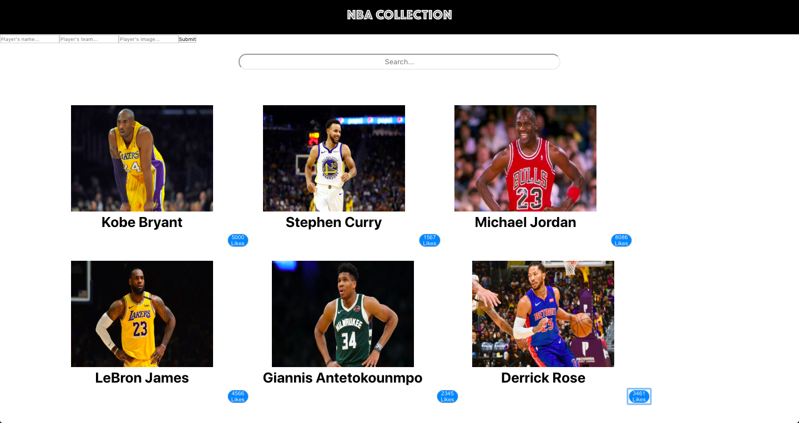

Hi Welcome to My NBA Player Collection!

This is just a practice lab that I made to practice my React Skills for my code challenge at my bootcamp.

First to start git fork && git clone that repo.

In your console fire npm install to install the react packages needed. cd into the repo in your console && npm start to fire the react server.

What you'll see on your browser is a really simple app(sorry for the styling it's not that cute, I mostly focus on the React functionality part of it for practice purposes).

What you can do:
- You can see all the players that I added.
- You can create a player
- You can like a player

As I mentionned above this a really basic React App. I did not implement any fetching yet. So any player created or liked will not persist after refreshing the page.

# nba-player-collection-react-practice
